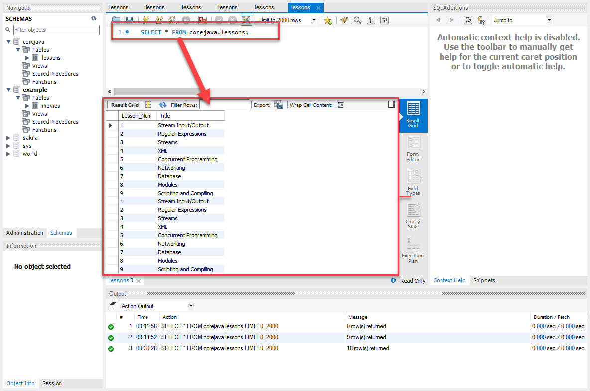
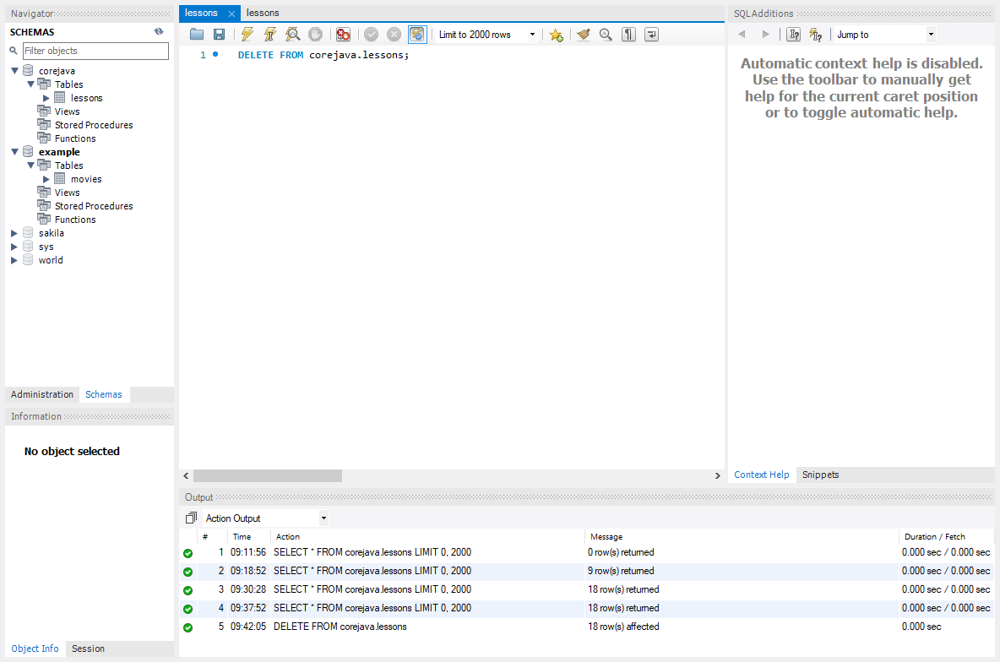

# Final Project for Advanced Java

This is the final project of the final course in a 5-course Java certificate program offered by the University of 
Southern California San Diego's Extension. During this final class, a new topic was presented during each of its 
nine weeks. Each week included a programming assignment, which gave us an opportunity to put 
new concepts into practice and hone our skills.

The purpose of this final project is to present a compendium of the programming assignments completed during this quarter. As such, I've created an interactive menu from which several of the programs I wrote during the class can be selected and run.

Some menu selections are non-interactive (i.e.,  run and done), while other menu selections are more dynamic; giving the user an opportunity to select parameters from a submenu prior to execution. Those programs accepting parameters can be rerun multiple times, with different parameters each time. Those programs not accepting parameters can be rerun multiple times as well, but typically they must be rerun from the main menu.

When started, the DemoDriver program presents a menu from which the user may select a program to run:

To launch a demonstration of a Java feature listed in the menu, enter the corresponding number. For example, to run the 
_I/O Stream_ demo, press 1…

…followed by the ENTER key:

To select one of the three Stream methodologies (e.g., Object, Binary or Text), press the corresponding number…

…followed by the ENTER key:

Regardless of which I/O Stream methodology you choose, ten thousand records will be processed. Most of the output 
generated will not fit on the screen.

At this point, you may run another I/O Stream demonstration by selecting from the menu any one of the three I/O Stream 
methodologies (i.e., Object, Binary or Text). Otherwise, you may enter 0…

…to return to the main menu:

For more information about how the program behind the I/O Stream demonstration works, go [here](resources/Lesson1.md).

The DemoDriver program's menu system should be self-explanatory. However, there wasn't sufficient testing performed 
to claim that it is bulletproof. Specifically, keyboard interactions can be a little finicky. The Scanner class can 
be a little difficult to work with when processing keyboard input. Most of the time, however, the program is well-behaved. Under most circumstances I found that simply pressing ENTER again solved the problem.

## A Few Caveats

When running the Networking demonstration, the program makes no provisions for ensuring that the connection gets closed. Consequently, if the Networking demonstration is run multiple times during the same session, the following error will be generated:

This occurs because the server wasn't shut down upon termination of the previous run. It's still running in the background. 
Consequently, it's still holding on to the port. The other side effect of this anomaly is that, although other menu 
items continue functioning normally, you will not be able to exit the program. Currently, the only solution is to restart DemoDriver. For more information about the programs behind the Networking demonstration, go [here](resources/Lesson7.md).

For the database demonstration, I used the MySQL server. When invoked, the database demonstration establishes a connection to the MySQL server, where it creates a database named corejava in which it creates a schema named Lessons. Thereafter, it populates the Lessons table with nine rows of data:

So far so good. The problem is that I never figured out how to prevent the server from allowing duplicate rows. 
Consequently, every time the database demo runs, it adds nine more rows the table:

I never figured out how to flush the table from the client side, so I had to do it from the server side using 
MySQL's Workbench:

By entering custom SQL into Workbench – in this case, the DELETE statement…

… I'm able to flush the table:

Then, when I run the Database demo again, I get the nine rows I'm expecting:

For more information about how the program behind the Database demonstration works, go [here](resources/Lesson7.md).    

For more information about how the program behind the XML demonstration works, go [here](resources/Lesson4.md).

For more information about how the program behind the Concurrency demonstration works, go [here](resources/Lesson5.md).

For more information about how the program behind the Streams demonstration works, go [here](resources/Lesson3.md).

